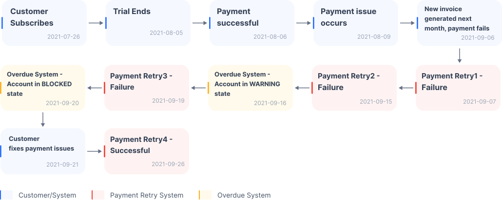

# Killbill : Testing the System - CLI 🪲🤑

This script enables you to simulate overdue payment scenarios, providing an efficient way to test:

- Your `overdue-payment-flow` in your KillBill server.
- Your custom `killbill-payment-plugin`, starting with the [payment-test plugin](https://github.com/killbill/killbill-payment-test-plugin).

This script mirrors the example provided in the [Killbill documentation](https://docs.killbill.io/latest/overdue#_testing_the_system)



# 🔧Features

- Display current UTC time
- Exit program
- Upload catalogs
- Create accounts
- Add payment methods
- Create subscriptions
- Change clock
- Configure Payment Test Plugin

# 🚀Getting Started

## Prerequisites

1. Ensure you have [python 3.x](https://www.python.org/) nstalled on your machine, along with [virtualenv](https://pypi.org/project/virtualenv/) (included in Python 3.3 and later).

2. Understand [What is Killbill](https://docs.killbill.io/latest/what_is_kill_bill) and have it installed on a server by following these [instructions](https://docs.killbill.io/latest/getting_started#installation).

3. Install the [payment-test plugin](https://github.com/killbill/killbill-payment-test-plugin) or a [custom plugin](https://docs.killbill.io/latest/plugin_development) following these [instructions](https://docs.killbill.io/latest/plugin_installation).

   For the [payment-test plugin](https://github.com/killbill/killbill-payment-test-plugin), you may need to:

   - Execute the following [DDL script](https://github.com/killbill/killbill-payment-test-plugin/blob/master/src/main/resources/ddl.sql) to manually create tables in the database.
   - Manually install the plugin and restart the server by following the instructions found [here](https://github.com/killbill/killbill-payment-test-plugin).

### Clone and go to the project directory

```bash
git clone https://github.com/albertolicea00/killbill-testing-system-CLI.git
```

```bash
cd killbill-testing-system-CLI
```

### Create a `.env` file from the `.env.example` and change the default values

### Create and activate virtual environment (optional)

```bash
python -m venv venv
```

- Mac / Linux : `source venv/bin/activate`

- WSL : `source venv/Scripts/activate`

- Windows : `venv\Scripts\activate`

## Install dependencies

```
pip install -r requirements.txt
```

## Execute the script

```
python main.py
```

## Follow the tutorial and enjoy : )

### Oficial Tutorial 📃 https://docs.killbill.io/latest/overdue#_testing_the_system

### Video Tutorial 📺 https://www.youtube.com/watch?v=WYZzXj4E9Go

<!-- [](https://www.youtube.com/watch?v=WYZzXj4E9Go) -->
